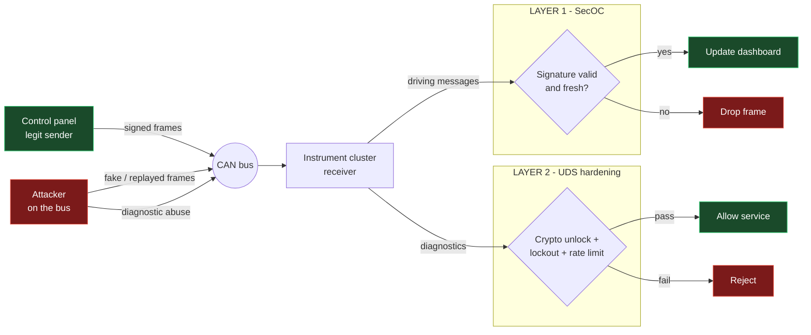
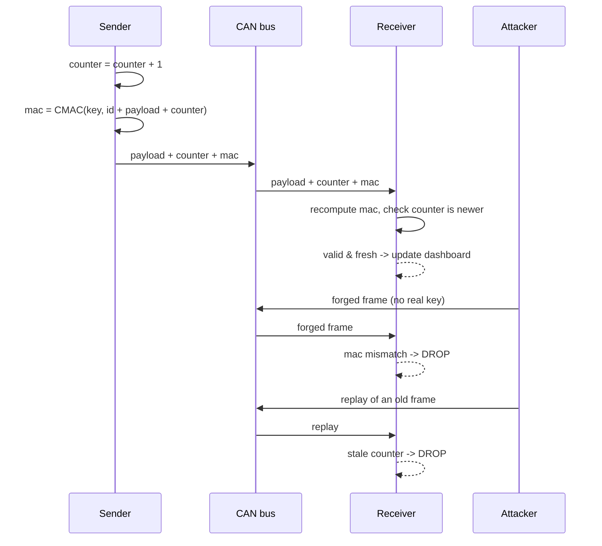
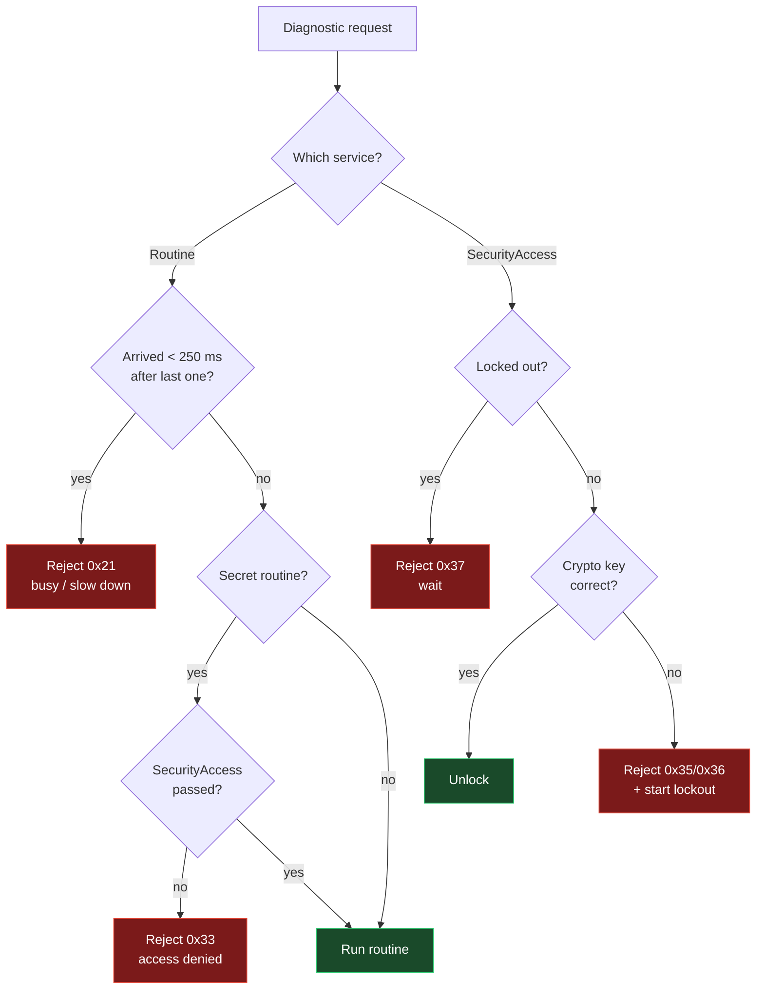
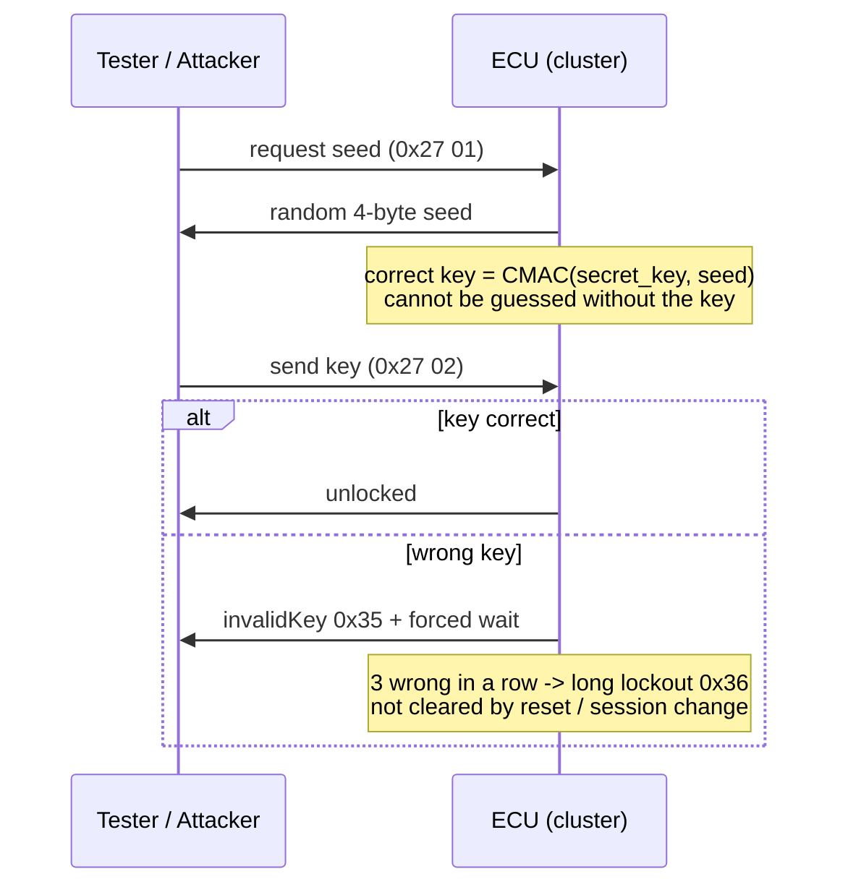

# Security Layer - Overview

A short, visual tour of the protections added to the **secured** simulator. Every idea is shown with a diagram and a few lines of simplified pseudocode, not the real C.

The goal here is the *big picture*, not every detail.

---

## Why anything was needed

A car's internal network (the **CAN bus**) was built for reliability, not
security. Two consequences:

- **Any device can send any message, and no message proves who sent it.**
  → an attacker can fake the speed, unlock doors, blink the turn signals.
- **The maintenance protocol (UDS) had weak locks.**
  → an attacker could brute-force its "security unlock" and reach hidden commands.

The secured build adds **two layers** to close these. The unsecured build keeps
the holes on purpose, so the same attacks can be tried on both and compared.



*(Diagram source: [`diagrams/overview.mmd`](diagrams/overview.mmd).)*

---

## Layer 1 - Messages that prove who sent them (SecOC)

**Idea.** Treat each message like a postcard and add a tamper-proof **wax seal**
plus a **page number**:

- **Seal (a MAC):** a short code computed from the message *and* a secret key
  shared only by the real computers. No key → no valid seal → **forgeries are
  rejected**.
- **Page number (a counter):** goes up by one each time. A recorded message
  played back later carries an old number → **replays are rejected**.



*(Diagram source: [`diagrams/block1-secoc.mmd`](diagrams/block1-secoc.mmd).)*

**Sending** (every real message gets stamped):

```text
counter = counter + 1
mac     = CMAC(secret_key, id + payload + counter)
send(payload + counter + mac)
```

**Receiving** (verify, or throw it away):

```text
expected = CMAC(secret_key, id + payload + counter)

if expected != received_mac:      drop()   # forged
elif counter <= last_seen[id]:    drop()   # replayed
else:
    last_seen[id] = counter
    accept()                               # safe to use
```

> **One honest limit:** this proves *who* sent a message, it does **not** hide
> it. Anyone can still listen on the bus - exactly like real cars, which don't
> encrypt CAN. So reading values (e.g. the VIN) still works; *forging* them does
> not.

---

## Layer 2 - Hardening the diagnostic "garage door" (UDS)

The maintenance protocol is a second way in. Layer 2 adds four gates, all using
standard ISO 14229 (UDS) mechanisms. Every diagnostic request must pass them:



*(Diagram source: [`diagrams/block2-gates.mmd`](diagrams/block2-gates.mmd).)*

### A · An unlock that can't be guessed

The "SecurityAccess" unlock is a challenge: the ECU sends a random **seed**, the
tool must reply with the matching **key**.

- *Before:* the key was a simple public rule (`seed XOR fixed bytes`) - cracked
  in a few dozen tries.
- *After:* the key is `CMAC(secret_key, seed)`. It depends on a secret key **and**
  a fresh random seed, so there is no rule to discover and no way to compute it
  without the key.



*(Diagram source: [`diagrams/block2-securityaccess.mmd`](diagrams/block2-securityaccess.mmd).)*

### B · Slow down and lock out guessing

Wrong guesses cost time, so automated scripts stall:

```text
if locked_until > now:        reject(0x37)            # still timed out
elif key == expected_key:     unlock(); fails = 0
else:
    fails = fails + 1
    locked_until = now + (fails >= 3 ? LONG : SHORT)   # 10 s vs 1 s
    reject(fails >= 3 ? 0x36 : 0x35)
```

The counter and lockout **survive an ECU reset or session change**, so an
attacker can't wipe the penalty - just like a real ECU.

### C · Guard the hidden command

A hidden privileged "routine" used to run for anyone in the diagnostic session.
Now it requires the unlock above first:

```text
if routine == SECRET and not security_unlocked:
    reject(0x33)            # must pass SecurityAccess first
```

### D · Rate-limit probing

A routine is a 3-byte number (~16.7 million possibilities), so attackers scan for
hidden ones. We cap the speed:

```text
if now - last_routine_time < 250 ms:
    reject(0x21)            # busy, slow down
last_routine_time = now
```

At one allowed try per 250 ms, a full scan goes from *minutes* to *weeks*.

---

## Before vs after, at a glance

| Attack | Unsecured | Secured | Layer |
|--------|-----------|---------|-------|
| Fake speed / unlock doors / fake blinker | works | **dropped** (bad seal) | 1 |
| Replay a recorded message | works | **dropped** (old counter) | 1 |
| Just listen / read the VIN | works | **still works** (by design) | - |
| Brute-force the diagnostic unlock | dozens of tries | **infeasible** (crypto + lockout) | 2A/2B |
| Wipe the lockout with a reset | n/a | **doesn't work** | 2B |
| Scan for the hidden routine | found fast | **blocked** (needs unlock + throttled) | 2C/2D |

---

## Two things this does NOT do

1. **It does not make traffic private.** An eavesdropper can still read the bus.
2. **Everything depends on one secret key.** If the key leaks, both layers fall.
   In this lab the key is kept simple; a real car stores it in secure hardware.

> Want the exact wire format, NRC codes, key bytes, and build flags? That level
> of detail lives in [`../SECURITY.md`](../SECURITY.md).
